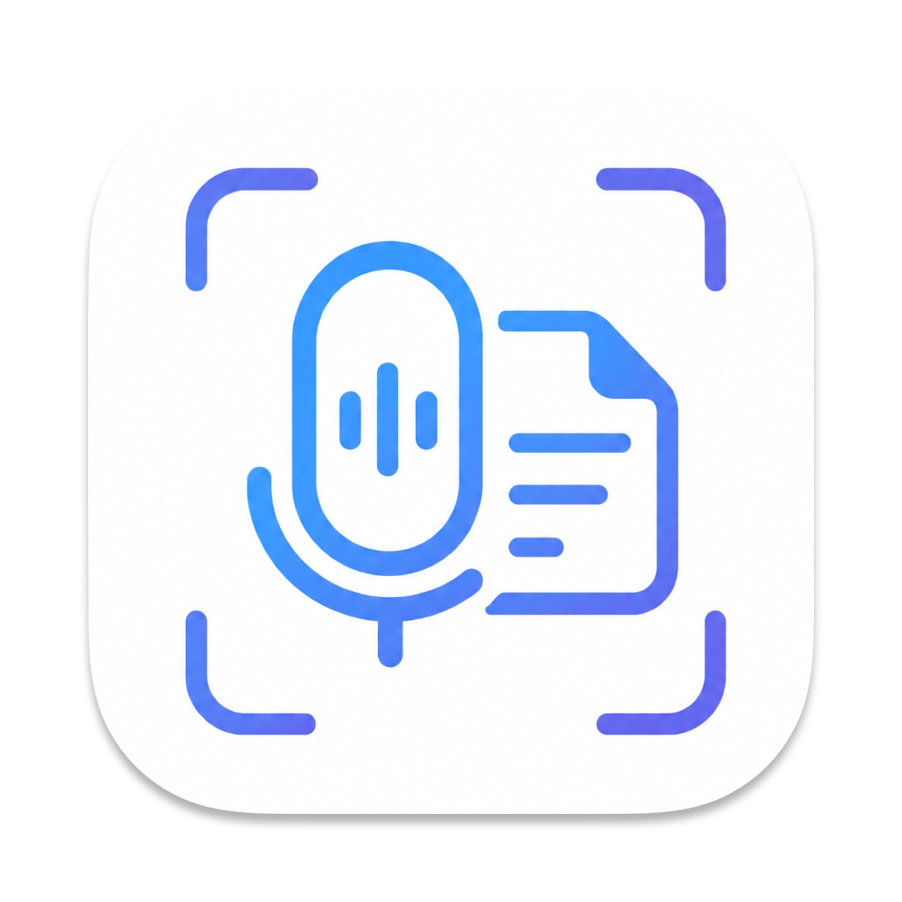

# Memonta

<p align="center">
  
</p>

<p align="center"><strong>End-to-end local workflow · Multilingual · Native macOS</strong></p>

<p align="center">
  <a href="#简体中文">简体中文</a> ·
  <a href="#繁體中文">繁體中文</a> ·
  <a href="#english">English</a> ·
  <a href="#español">Español</a> ·
  <a href="#français">Français</a>
</p>

<p align="center">
  <sub>21 interface locales: 简体中文 · 繁體中文 · English · 日本語 · 한국어 · Deutsch · Français · Español · Italiano · Português · Русский · Українська · Nederlands · Polski · Türkçe · العربية · हिन्दी · Bahasa Indonesia · Svenska · ไทย · Tiếng Việt</sub>
</p>

## 简体中文

Memonta 是一款支持全流程本地处理的多语言原生 macOS 会议助手，使用 SwiftUI 构建。它把会议录音、音视频导入、本地转写、说话人分离、AI 总结、可编辑待办、截图与图片笔记整合在一个可恢复的工作流中。

项目仅支持 macOS 15 及以上版本，不包含 iOS 应用或分享扩展。

### 核心能力

- **可靠采集**：同时录制麦克风与系统音频，使用分片写入、崩溃恢复和磁盘空间保护降低长会议丢失风险。
- **本地语音智能**：使用 WhisperKit 转写，使用 sherpa-onnx 完成说话人分离，并支持声纹识别、繁简归一和自定义词典纠正。
- **从记录到行动**：通过全局处理队列串联转写、视频画面分析、总结与待办提取；写入系统提醒事项前始终由用户确认。
- **灵活的模型接入**：支持用户配置的 OpenAI 兼容接口，也可连接 LM Studio、Ollama 等本地服务。
- **视觉笔记**：支持全局截图、标注、OCR、图片笔记，以及基于视频关键帧的画面要点分析。
- **文件优先存储**：`~/Documents/Memonta/` 中的条目文件夹是权威数据源，SwiftData 用作索引，便于浏览、备份与恢复。
- **多语言界面**：提供 21 个界面语言区域，可跟随系统语言，也可从应用菜单切换。

### 多语言支持现状

- **界面本地化**：简体中文是源语言，另有 20 种完整目标语言。文案由 String Catalog 管理，CI 会检查缺失或空翻译、占位符和复数分支；当前自动检查全部通过。
- **语音转写**：Whisper 模式提供自动检测及 21 个显式语言选项，并支持中英混合内容。macOS 系统语音识别会根据所选语言与本机可用的系统语言模型工作，实际可用范围由 macOS 决定。
- **中文处理**：选择简体或繁体中文会决定转写后的繁简归一方向，随后再应用自定义词典纠正；不会改写既有历史转写。
- **OCR 语言**：本地 Vision OCR 按“当前转写语言 → 应用界面语言 → 系统首选语言”的顺序选择候选，并自动回退到系统实际支持的识别语言。
- **当前边界**：阿拉伯语已包含本地化与 RTL 适配代码，但完整 RTL、键盘导航及无障碍体验仍需在发布前进行界面验证。

### 数据存储与外部传输

- 录音、转写、总结、截图和模型默认保存在本机；转写、总结和待办等文本产物使用应用的加密存储路径。
- 选择云端语音转写时会上传音频；选择远端 LLM 或多模态模型时，会按请求需要发送文本、图片或视频关键帧。
- 云端文本请求可使用本地 PII 脱敏与结果还原；该文本脱敏不适用于图片或视频帧。
- API Key 与加密密钥存放在 macOS Keychain 中，不写入普通偏好设置或项目文件。
- 请勿在公开 issue 中提交会议内容、API Key、原始崩溃报告或其他敏感数据。安全问题请按[安全政策](SECURITY.md)私下报告。

### 环境要求

- macOS 15 或更高版本
- Xcode 27
- Swift 6
- [XcodeGen](https://github.com/yonaskolb/XcodeGen)

### 快速构建

```sh
xcodegen generate
DEVELOPER_DIR=/Applications/Xcode.app/Contents/Developer \
  xcodebuild \
  -project Memonta.xcodeproj \
  -scheme Memonta \
  -configuration Debug \
  -destination 'platform=macOS' \
  CODE_SIGNING_ALLOWED=NO \
  CODE_SIGNING_REQUIRED=NO \
  DEVELOPMENT_TEAM= \
  build
```

`project.yml` 是工程配置的唯一事实源，请勿直接修改生成的 `Memonta.xcodeproj`。首次运行会按功能请求麦克风、屏幕录制、语音识别、辅助功能或提醒事项权限。本地模型不随源码仓库分发，可在应用内下载或手动指定模型目录。

### 验证

```sh
# 检查本地化资源
python3 Scripts/check_l10n.py

# 运行单元测试
DEVELOPER_DIR=/Applications/Xcode.app/Contents/Developer \
  xcodebuild \
  -project Memonta.xcodeproj \
  -scheme Memonta \
  -configuration Debug \
  -destination 'platform=macOS' \
  CODE_SIGN_IDENTITY=- \
  CODE_SIGN_STYLE=Manual \
  DEVELOPMENT_TEAM= \
  test -only-testing:MemontaTests
```

UI 测试需要有图形界面的 macOS 会话和相应系统权限，因此不在基础 CI 中运行。完整说明见[构建与运行](docs/wiki/13-构建与运行.md)。

### 项目导航

- `project.yml`：XcodeGen 工程定义与依赖配置
- `Memonta/Models/`：持久化模型与文件布局
- `Memonta/Services/`：音频、转写、LLM、截图、同步与安全服务
- `Memonta/ViewModels/`、`Memonta/Views/`：业务编排与 SwiftUI 界面
- `MemontaTests/`：Swift Testing 单元测试
- [产品需求](PRD.md) · [开发实践](DEVELOPMENT_GUIDE.md) · [项目 Wiki](docs/wiki/Home.md) · [发布检查](docs/RELEASE_CHECKLIST.md)

### 许可证

Memonta 源代码以 [MIT License](LICENSE) 发布。第三方依赖、词典及用户另行下载的模型适用各自的许可证，详见[第三方声明](THIRD_PARTY_NOTICES.md)。MIT 许可证不自动授予 Memonta 名称、图标或其他商标的使用权。

## 繁體中文

Memonta 是一款支援全流程本機處理的多語言原生 macOS 會議助理，使用 SwiftUI 建置。它將會議錄音、音訊與影片匯入、本機轉錄、講者分離、AI 摘要、可編輯待辦事項、螢幕截圖與圖片筆記整合成可復原的工作流程。

本專案僅支援 macOS 15 或以上版本，不包含 iOS App 或分享延伸功能。

### 核心功能

- **可靠錄製**：同時錄製麥克風與系統音訊，透過分段寫入、當機復原與磁碟空間保護，降低長時間會議的資料遺失風險。
- **本機語音智慧**：使用 WhisperKit 轉錄，使用 sherpa-onnx 進行講者分離，並支援聲紋辨識、繁簡正規化與自訂詞典校正。
- **從記錄到行動**：透過全域處理佇列依序執行轉錄、影片畫面分析、摘要與待辦事項擷取；寫入系統「提醒事項」前一律由使用者確認。
- **彈性的模型連線**：支援使用者設定的 OpenAI 相容介面，也可連接 LM Studio、Ollama 等本機服務。
- **視覺筆記**：支援全域截圖、標註、OCR、圖片筆記，以及根據影片關鍵影格產生畫面重點。
- **檔案優先儲存**：`~/Documents/Memonta/` 中的項目資料夾是權威資料來源，SwiftData 作為索引，方便瀏覽、備份與復原。
- **多語言介面**：提供 21 個介面語言區域，可跟隨系統語言，也可從 App 選單切換。

### 多語言支援現況

- **介面本地化**：簡體中文是來源語言，另有 20 種完整目標語言。文案由 String Catalog 管理，CI 會檢查缺漏或空白翻譯、預留位置與複數分支；目前自動檢查全部通過。
- **語音轉錄**：Whisper 模式提供自動偵測及 21 個明確語言選項，並支援中英混合內容。macOS 系統語音辨識會依所選語言與本機可用的系統語言模型運作，實際可用範圍由 macOS 決定。
- **中文處理**：選擇簡體或繁體中文會決定轉錄後的繁簡正規化方向，之後再套用自訂詞典校正；不會回溯修改既有轉錄。
- **OCR 語言**：本機 Vision OCR 依「目前轉錄語言 → App 介面語言 → 系統偏好語言」選擇候選，並自動回退至系統實際支援的辨識語言。
- **目前界線**：阿拉伯文已包含本地化與 RTL 適配程式碼，但完整 RTL、鍵盤導覽及無障礙體驗仍須在發佈前進行介面驗證。

### 資料儲存與外部傳輸

- 錄音、轉錄、摘要、截圖與模型預設保存在本機；轉錄、摘要與待辦事項等文字產物使用 App 的加密儲存流程。
- 選擇雲端語音轉錄時會上傳音訊；選擇遠端 LLM 或多模態模型時，會依請求需要傳送文字、圖片或影片關鍵影格。
- 雲端文字請求可使用本機 PII 去識別化與結果還原；此文字去識別化不適用於圖片或影片影格。
- API Key 與加密金鑰儲存在 macOS Keychain，不會寫入一般偏好設定或專案檔案。
- 請勿在公開 issue 中提交會議內容、API Key、原始當機報告或其他敏感資料。安全問題請依照[安全政策](SECURITY.md)私下回報。

### 環境需求

- macOS 15 或以上版本
- Xcode 27
- Swift 6
- [XcodeGen](https://github.com/yonaskolb/XcodeGen)

### 快速建置

```sh
xcodegen generate
DEVELOPER_DIR=/Applications/Xcode.app/Contents/Developer \
  xcodebuild \
  -project Memonta.xcodeproj \
  -scheme Memonta \
  -configuration Debug \
  -destination 'platform=macOS' \
  CODE_SIGNING_ALLOWED=NO \
  CODE_SIGNING_REQUIRED=NO \
  DEVELOPMENT_TEAM= \
  build
```

`project.yml` 是專案設定的唯一事實來源，請勿直接修改產生的 `Memonta.xcodeproj`。首次啟動時，Memonta 會依功能需求要求麥克風、螢幕錄製、語音辨識、輔助使用或提醒事項權限。本機模型不隨原始碼儲存庫提供，可在 App 內下載或手動指定模型資料夾。

### 驗證

```sh
# 檢查本地化資源
python3 Scripts/check_l10n.py

# 執行單元測試
DEVELOPER_DIR=/Applications/Xcode.app/Contents/Developer \
  xcodebuild \
  -project Memonta.xcodeproj \
  -scheme Memonta \
  -configuration Debug \
  -destination 'platform=macOS' \
  CODE_SIGN_IDENTITY=- \
  CODE_SIGN_STYLE=Manual \
  DEVELOPMENT_TEAM= \
  test -only-testing:MemontaTests
```

UI 測試需要有圖形介面的 macOS 工作階段及相應系統權限，因此不在基礎 CI 中執行。完整說明請參閱[建置與執行](docs/wiki/13-构建与运行.md)。

### 專案導覽

- `project.yml`：XcodeGen 專案定義與相依套件設定
- `Memonta/Models/`：持久化模型與檔案配置
- `Memonta/Services/`：音訊、轉錄、LLM、截圖、同步與安全服務
- `Memonta/ViewModels/`、`Memonta/Views/`：業務流程協調與 SwiftUI 介面
- `MemontaTests/`：Swift Testing 單元測試
- [產品需求](PRD.md) · [開發實務](DEVELOPMENT_GUIDE.md) · [專案 Wiki](docs/wiki/Home.md) · [發佈檢查](docs/RELEASE_CHECKLIST.md)

### 授權條款

Memonta 原始碼依 [MIT License](LICENSE) 發佈。第三方相依套件、詞典與使用者另行下載的模型各自適用其授權條款，詳見[第三方聲明](THIRD_PARTY_NOTICES.md)。MIT License 不會自動授予 Memonta 名稱、圖示或其他商標的使用權。

## English

Memonta is a multilingual, native macOS meeting assistant built with SwiftUI and designed to support an end-to-end local workflow. It brings meeting recording, audio and video import, local transcription, speaker diarization, AI summaries, editable action items, screenshots, and image notes into one recoverable workflow.

The project supports macOS 15 and later only. It does not include an iOS app or share extension.

### Highlights

- **Reliable capture**: Record microphone and system audio together, with segmented writes, crash recovery, and disk-space safeguards for long meetings.
- **On-device speech intelligence**: Transcribe with WhisperKit, diarize with sherpa-onnx, and refine results with voiceprints, Chinese script normalization, and custom dictionaries.
- **From notes to action**: Run transcription, video analysis, summarization, and action-item extraction through a global processing queue. Writing to Reminders always requires user confirmation.
- **Flexible model connections**: Use a user-configured OpenAI-compatible endpoint or connect to local services such as LM Studio and Ollama.
- **Visual notes**: Capture and annotate the screen, run OCR, create image notes, and analyze video keyframes for visual highlights.
- **File-first storage**: Entry folders under `~/Documents/Memonta/` are the source of truth; SwiftData serves as an index for browsing, backup, and recovery.
- **Multilingual interface**: Choose from 21 interface locales, follow the system language, or switch languages from the app menu.

### Multilingual Support Today

- **Interface localization**: Simplified Chinese is the source language, with 20 fully populated target locales. String Catalog manages user-facing copy, while CI checks missing or empty translations, placeholders, and plural branches; the current automated check passes without errors or warnings.
- **Speech transcription**: Whisper modes provide automatic detection plus 21 explicit language choices and support mixed Chinese-English content. macOS system transcription uses the selected language and locally available system language models, so actual availability depends on macOS.
- **Chinese normalization**: Selecting Simplified or Traditional Chinese controls post-transcription script normalization before custom dictionary correction. Existing transcripts are not rewritten retroactively.
- **OCR languages**: On-device Vision OCR selects candidates in the order “recording language → app language → system preferences” and falls back to languages actually supported by the system.
- **Current boundary**: Arabic localization and RTL-aware code are present, but complete RTL, keyboard-navigation, and accessibility behavior still require UI validation before release.

### Data Storage and External Transfers

- Recordings, transcripts, summaries, screenshots, and models are stored locally by default. Text artifacts such as transcripts, summaries, and action items use the app's encrypted persistence paths.
- Cloud speech transcription uploads audio. A remote LLM or multimodal model receives the text, images, or video keyframes required for the selected request.
- Cloud text requests can use local PII scrubbing and result restoration. This text scrubbing does not apply to images or video frames.
- API keys and encryption keys are stored in the macOS Keychain, not in ordinary preferences or project files.
- Do not post meeting content, API keys, original crash reports, or other sensitive data in public issues. Report security concerns privately according to the [Security Policy](SECURITY.md).

### Requirements

- macOS 15 or later
- Xcode 27
- Swift 6
- [XcodeGen](https://github.com/yonaskolb/XcodeGen)

### Quick Build

```sh
xcodegen generate
DEVELOPER_DIR=/Applications/Xcode.app/Contents/Developer \
  xcodebuild \
  -project Memonta.xcodeproj \
  -scheme Memonta \
  -configuration Debug \
  -destination 'platform=macOS' \
  CODE_SIGNING_ALLOWED=NO \
  CODE_SIGNING_REQUIRED=NO \
  DEVELOPMENT_TEAM= \
  build
```

`project.yml` is the single source of truth for project configuration. Do not edit the generated `Memonta.xcodeproj` directly. On first launch, Memonta requests microphone, screen recording, speech recognition, accessibility, or Reminders permissions as needed. Local models are not distributed with the source repository; download them in the app or specify a model directory manually.

### Verification

```sh
# Check localization resources
python3 Scripts/check_l10n.py

# Run unit tests
DEVELOPER_DIR=/Applications/Xcode.app/Contents/Developer \
  xcodebuild \
  -project Memonta.xcodeproj \
  -scheme Memonta \
  -configuration Debug \
  -destination 'platform=macOS' \
  CODE_SIGN_IDENTITY=- \
  CODE_SIGN_STYLE=Manual \
  DEVELOPMENT_TEAM= \
  test -only-testing:MemontaTests
```

UI tests require a graphical macOS session and the relevant system permissions, so they are not included in the basic CI workflow. See [Build and Run](docs/wiki/13-构建与运行.md) for complete instructions.

### Project Map

- `project.yml`: XcodeGen project definition and dependency configuration
- `Memonta/Models/`: persistence models and file layout
- `Memonta/Services/`: audio, transcription, LLM, screenshot, sync, and security services
- `Memonta/ViewModels/`, `Memonta/Views/`: business orchestration and SwiftUI interface
- `MemontaTests/`: Swift Testing unit tests
- [Product Requirements](PRD.md) · [Development Guide](DEVELOPMENT_GUIDE.md) · [Project Wiki](docs/wiki/Home.md) · [Release Checklist](docs/RELEASE_CHECKLIST.md)

### License

Memonta source code is released under the [MIT License](LICENSE). Third-party dependencies, dictionaries, and separately downloaded models remain subject to their respective licenses; see [Third-Party Notices](THIRD_PARTY_NOTICES.md). The MIT License does not grant permission to use the Memonta name, icon, or other trademarks.

## Español

Memonta es un asistente de reuniones multilingüe y nativo para macOS, desarrollado con SwiftUI y compatible con un flujo completamente local. Reúne la grabación de reuniones, la importación de audio y vídeo, la transcripción local, la separación de hablantes, los resúmenes con IA, las tareas editables, las capturas de pantalla y las notas con imágenes en un único flujo recuperable.

El proyecto solo es compatible con macOS 15 o posterior. No incluye una aplicación para iOS ni una extensión para compartir.

### Funciones principales

- **Captura fiable**: graba a la vez el micrófono y el audio del sistema, con escritura por segmentos, recuperación tras fallos y protección del espacio en disco para reuniones largas.
- **Procesamiento de voz en el dispositivo**: transcribe con WhisperKit, separa hablantes con sherpa-onnx y mejora los resultados mediante huellas de voz, normalización de caracteres chinos y diccionarios personalizados.
- **De las notas a la acción**: ejecuta la transcripción, el análisis de vídeo, el resumen y la extracción de tareas mediante una cola global. Escribir en Recordatorios siempre requiere la confirmación del usuario.
- **Conexiones flexibles con modelos**: utiliza un endpoint compatible con OpenAI configurado por el usuario o servicios locales como LM Studio y Ollama.
- **Notas visuales**: captura y anota la pantalla, ejecuta OCR, crea notas con imágenes y analiza fotogramas clave de vídeo.
- **Almacenamiento basado en archivos**: las carpetas de `~/Documents/Memonta/` son la fuente de verdad; SwiftData funciona como índice para facilitar la consulta, la copia de seguridad y la recuperación.
- **Interfaz multilingüe**: ofrece 21 configuraciones regionales, puede seguir el idioma del sistema y permite cambiarlo desde el menú de la aplicación.

### Estado actual del soporte multilingüe

- **Localización de la interfaz**: el chino simplificado es el idioma de origen y hay 20 configuraciones regionales de destino completas. String Catalog gestiona los textos visibles; CI comprueba traducciones ausentes o vacías, marcadores y formas plurales. La comprobación automatizada actual no presenta errores ni advertencias.
- **Transcripción de voz**: los modos Whisper ofrecen detección automática y 21 opciones de idioma explícitas, además de admitir contenido mixto en chino e inglés. La transcripción del sistema macOS utiliza el idioma elegido y los modelos instalados localmente, por lo que la disponibilidad real depende de macOS.
- **Normalización del chino**: elegir chino simplificado o tradicional determina la conversión posterior a la transcripción antes de aplicar las correcciones del diccionario personalizado. Las transcripciones existentes no se modifican de forma retroactiva.
- **Idiomas de OCR**: Vision OCR selecciona los candidatos en el orden «idioma de la grabación → idioma de la aplicación → preferencias del sistema» y recurre a los idiomas que el sistema admite realmente.
- **Límite actual**: existen localización en árabe y código adaptado a RTL, pero el comportamiento completo de RTL, navegación por teclado y accesibilidad todavía requiere validación visual antes de cada versión.

### Almacenamiento de datos y transferencias externas

- Las grabaciones, transcripciones, resúmenes, capturas y modelos se guardan localmente de forma predeterminada. Los artefactos de texto, como transcripciones, resúmenes y tareas, utilizan las rutas de persistencia cifrada de la aplicación.
- La transcripción de voz en la nube sube el audio. Un LLM remoto o un modelo multimodal recibe el texto, las imágenes o los fotogramas clave necesarios para la solicitud elegida.
- Las solicitudes de texto en la nube pueden aplicar anonimización local de datos personales y restaurar después el resultado. Esta protección de texto no se aplica a imágenes ni a fotogramas de vídeo.
- Las claves de API y de cifrado se guardan en el Llavero de macOS, no en preferencias comunes ni en archivos del proyecto.
- No publiques contenido de reuniones, claves de API, informes de fallos originales ni otros datos sensibles en incidencias públicas. Comunica los problemas de seguridad de forma privada según la [política de seguridad](SECURITY.md).

### Requisitos

- macOS 15 o posterior
- Xcode 27
- Swift 6
- [XcodeGen](https://github.com/yonaskolb/XcodeGen)

### Compilación rápida

```sh
xcodegen generate
DEVELOPER_DIR=/Applications/Xcode.app/Contents/Developer \
  xcodebuild \
  -project Memonta.xcodeproj \
  -scheme Memonta \
  -configuration Debug \
  -destination 'platform=macOS' \
  CODE_SIGNING_ALLOWED=NO \
  CODE_SIGNING_REQUIRED=NO \
  DEVELOPMENT_TEAM= \
  build
```

`project.yml` es la única fuente de verdad para la configuración del proyecto. No edites directamente el archivo `Memonta.xcodeproj` generado. En el primer inicio, Memonta solicita permisos de micrófono, grabación de pantalla, reconocimiento de voz, accesibilidad o Recordatorios según sea necesario. Los modelos locales no se distribuyen con el repositorio; descárgalos desde la aplicación o indica manualmente su carpeta.

### Verificación

```sh
# Comprobar los recursos de localización
python3 Scripts/check_l10n.py

# Ejecutar las pruebas unitarias
DEVELOPER_DIR=/Applications/Xcode.app/Contents/Developer \
  xcodebuild \
  -project Memonta.xcodeproj \
  -scheme Memonta \
  -configuration Debug \
  -destination 'platform=macOS' \
  CODE_SIGN_IDENTITY=- \
  CODE_SIGN_STYLE=Manual \
  DEVELOPMENT_TEAM= \
  test -only-testing:MemontaTests
```

Las pruebas de interfaz requieren una sesión gráfica de macOS y los permisos correspondientes, por lo que no forman parte del flujo básico de CI. Consulta [Compilación y ejecución](docs/wiki/13-构建与运行.md) para obtener las instrucciones completas.

### Mapa del proyecto

- `project.yml`: definición del proyecto XcodeGen y configuración de dependencias
- `Memonta/Models/`: modelos de persistencia y estructura de archivos
- `Memonta/Services/`: servicios de audio, transcripción, LLM, capturas, sincronización y seguridad
- `Memonta/ViewModels/`, `Memonta/Views/`: coordinación de la lógica e interfaz SwiftUI
- `MemontaTests/`: pruebas unitarias con Swift Testing
- [Requisitos del producto](PRD.md) · [Guía de desarrollo](DEVELOPMENT_GUIDE.md) · [Wiki del proyecto](docs/wiki/Home.md) · [Lista de publicación](docs/RELEASE_CHECKLIST.md)

### Licencia

El código fuente de Memonta se publica bajo la [licencia MIT](LICENSE). Las dependencias de terceros, los diccionarios y los modelos descargados por separado conservan sus propias licencias; consulta los [avisos de terceros](THIRD_PARTY_NOTICES.md). La licencia MIT no concede permiso para utilizar el nombre, el icono ni otras marcas de Memonta.

## Français

Memonta est un assistant de réunion multilingue et natif pour macOS, développé avec SwiftUI et conçu pour prendre en charge un flux de travail entièrement local. Il réunit l’enregistrement de réunions, l’importation audio et vidéo, la transcription locale, la séparation des locuteurs, les résumés par IA, les tâches modifiables, les captures d’écran et les notes illustrées dans un flux de travail récupérable.

Le projet prend uniquement en charge macOS 15 ou version ultérieure. Il ne comprend ni application iOS ni extension de partage.

### Fonctionnalités principales

- **Capture fiable** : enregistre simultanément le microphone et l’audio système, avec écriture segmentée, récupération après incident et protection de l’espace disque pour les longues réunions.
- **Traitement vocal sur l’appareil** : transcrit avec WhisperKit, sépare les locuteurs avec sherpa-onnx et affine les résultats grâce aux empreintes vocales, à la normalisation des caractères chinois et aux dictionnaires personnalisés.
- **Des notes à l’action** : exécute la transcription, l’analyse vidéo, la synthèse et l’extraction des tâches via une file de traitement globale. L’écriture dans Rappels nécessite toujours la confirmation de l’utilisateur.
- **Connexion flexible aux modèles** : utilise un endpoint compatible avec OpenAI configuré par l’utilisateur ou des services locaux tels que LM Studio et Ollama.
- **Notes visuelles** : capture et annote l’écran, effectue l’OCR, crée des notes illustrées et analyse les images clés des vidéos.
- **Stockage fondé sur les fichiers** : les dossiers sous `~/Documents/Memonta/` constituent la source de vérité ; SwiftData sert d’index pour la consultation, la sauvegarde et la récupération.
- **Interface multilingue** : propose 21 paramètres régionaux, peut suivre la langue du système et permet de changer de langue depuis le menu de l’application.

### État actuel de la prise en charge multilingue

- **Localisation de l’interface** : le chinois simplifié est la langue source et 20 paramètres régionaux cibles sont entièrement renseignés. String Catalog gère les textes visibles ; la CI contrôle les traductions manquantes ou vides, les paramètres de format et les branches de pluriel. Le contrôle automatisé actuel ne signale aucune erreur ni aucun avertissement.
- **Transcription vocale** : les modes Whisper proposent la détection automatique et 21 choix de langue explicites, tout en prenant en charge les contenus mêlant chinois et anglais. La transcription système de macOS utilise la langue choisie et les modèles linguistiques disponibles localement ; sa disponibilité réelle dépend donc de macOS.
- **Normalisation du chinois** : le choix du chinois simplifié ou traditionnel détermine la conversion appliquée après la transcription, avant les corrections du dictionnaire personnalisé. Les transcriptions existantes ne sont pas réécrites rétroactivement.
- **Langues de l’OCR** : Vision OCR sélectionne les langues candidates dans l’ordre « langue de l’enregistrement → langue de l’application → préférences système », puis se rabat sur les langues réellement prises en charge par le système.
- **Limite actuelle** : la localisation arabe et le code adapté au RTL sont présents, mais le comportement complet du RTL, de la navigation au clavier et de l’accessibilité doit encore être validé dans l’interface avant publication.

### Stockage des données et transferts externes

- Les enregistrements, transcriptions, résumés, captures d’écran et modèles sont conservés localement par défaut. Les contenus textuels tels que les transcriptions, résumés et tâches utilisent les chemins de stockage chiffré de l’application.
- La transcription vocale dans le cloud envoie l’audio. Un LLM distant ou un modèle multimodal reçoit le texte, les images ou les images clés nécessaires à la requête sélectionnée.
- Les requêtes textuelles envoyées dans le cloud peuvent appliquer localement une pseudonymisation des données personnelles, puis restaurer le résultat. Cette protection textuelle ne s’applique pas aux images ni aux images vidéo.
- Les clés d’API et de chiffrement sont stockées dans le Trousseau macOS, et non dans les préférences ordinaires ou les fichiers du projet.
- Ne publiez pas de contenu de réunion, de clés d’API, de rapports d’incident originaux ni d’autres données sensibles dans les issues publiques. Signalez les problèmes de sécurité de manière privée conformément à la [politique de sécurité](SECURITY.md).

### Prérequis

- macOS 15 ou version ultérieure
- Xcode 27
- Swift 6
- [XcodeGen](https://github.com/yonaskolb/XcodeGen)

### Compilation rapide

```sh
xcodegen generate
DEVELOPER_DIR=/Applications/Xcode.app/Contents/Developer \
  xcodebuild \
  -project Memonta.xcodeproj \
  -scheme Memonta \
  -configuration Debug \
  -destination 'platform=macOS' \
  CODE_SIGNING_ALLOWED=NO \
  CODE_SIGNING_REQUIRED=NO \
  DEVELOPMENT_TEAM= \
  build
```

`project.yml` est l’unique source de vérité pour la configuration du projet. Ne modifiez pas directement le fichier `Memonta.xcodeproj` généré. Au premier lancement, Memonta demande, selon les besoins, les autorisations d’accès au microphone, à l’enregistrement de l’écran, à la reconnaissance vocale, à l’accessibilité ou à Rappels. Les modèles locaux ne sont pas distribués avec le dépôt source ; téléchargez-les depuis l’application ou indiquez manuellement leur dossier.

### Vérification

```sh
# Vérifier les ressources de localisation
python3 Scripts/check_l10n.py

# Exécuter les tests unitaires
DEVELOPER_DIR=/Applications/Xcode.app/Contents/Developer \
  xcodebuild \
  -project Memonta.xcodeproj \
  -scheme Memonta \
  -configuration Debug \
  -destination 'platform=macOS' \
  CODE_SIGN_IDENTITY=- \
  CODE_SIGN_STYLE=Manual \
  DEVELOPMENT_TEAM= \
  test -only-testing:MemontaTests
```

Les tests d’interface nécessitent une session graphique macOS et les autorisations système correspondantes ; ils ne sont donc pas exécutés dans le workflow CI de base. Consultez [Compilation et exécution](docs/wiki/13-构建与运行.md) pour les instructions complètes.

### Structure du projet

- `project.yml` : définition du projet XcodeGen et configuration des dépendances
- `Memonta/Models/` : modèles de persistance et organisation des fichiers
- `Memonta/Services/` : services audio, transcription, LLM, capture d’écran, synchronisation et sécurité
- `Memonta/ViewModels/`, `Memonta/Views/` : orchestration métier et interface SwiftUI
- `MemontaTests/` : tests unitaires avec Swift Testing
- [Exigences produit](PRD.md) · [Guide de développement](DEVELOPMENT_GUIDE.md) · [Wiki du projet](docs/wiki/Home.md) · [Liste de vérification avant publication](docs/RELEASE_CHECKLIST.md)

### Licence

Le code source de Memonta est publié sous [licence MIT](LICENSE). Les dépendances tierces, les dictionnaires et les modèles téléchargés séparément restent soumis à leurs licences respectives ; consultez les [mentions relatives aux tiers](THIRD_PARTY_NOTICES.md). La licence MIT n’accorde aucun droit d’utiliser le nom, l’icône ou les autres marques de Memonta.
